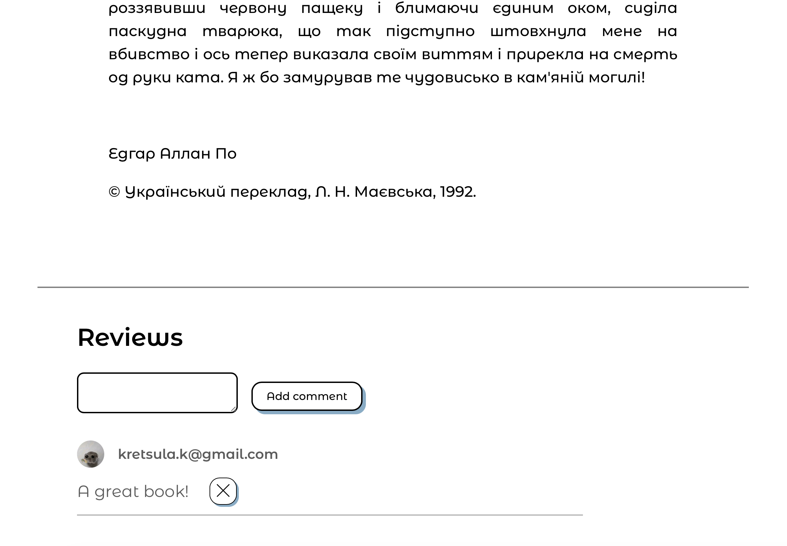

<div align="center">
    <br>
    
    <h1 style="margin: 0">Readly</h1>
    <br>
</div>

<h4 align="center" style='margin: 0 10px;'>
A platform for enhancing the reading experience by offering a daily dose of captivating writings.
</h4>

<p align="center">
  <a href="#description">Description</a> •
  <a href="#how-to-use">How To Use</a> •
  <a href="#example-of-usage">Example of usage</a> •
  <a href="#emailware">Emailware</a>
</p>

## Description

Our mission is to cultivate a vibrant community where individuals can explore diverse perspectives, share their stories, and unleash their creativity.

### Key Features:

- **Daily Writings**:  
  Enjoy a fresh selection of stories and articles every day, crafted to inspire and entertain.

- **Engaging Discussions**:  
  Join thought-provoking discussions, absorb inspiring perspectives, and contribute your own insights.

- **Supportive Community**:  
  Connect with a community of like-minded individuals who support and inspire each other.  

- **Reader Reviews**:  
  Discover how Readly has impacted the lives of our readers through their heartfelt testimonials.

- **Exclusive Membership Benefits**:  
  Unlock personalized content, exclusive writings, special merchandise, and more. Participate in live events, workshops, and author interviews.

- **Recent Writings**:  
  Stay up-to-date with our latest content and explore a wide range of topics.

### Why Join Readly?

- **Inspiration and Growth**:  
  Readly is more than just a reading platform; it's a place for personal and creative growth. Whether you're looking for inspiration or a supportive community to share your ideas, Readly has something for everyone.

- **Exclusive Content**:  
  Members gain access to exclusive content and events that aren't available to the general public. Enjoy unique writings, live broadcasts, and opportunities to connect with authors and creators.

- **Tailored Experience**:  
  Customize your reading experience by requesting topics that resonate with you and receive content that aligns with your interests.

### How to Get Started?

- **Sign Up**:  
  Create an account on our website to start exploring our diverse content.

- **Join the Community**:  
  Connect with other members, participate in discussions, and share your stories.

- **Access Exclusive Content**:  
  Become a member to unlock special perks, exclusive writings, and much more.

## How To Use

Go to our website [Readly](https://anywriter.nw.r.appspot.com/) to see the web application.

Alternatively, clone this repository and run the web application:

```bash
git clone https://github.com/kostyaCS/anywriter.git
cd anywriter
npm i
npm start
```

It runs the app in the development mode.\
To view it in your browser open [http://localhost:3000](http://localhost:3000).

## How To Use

You can access the web application by visiting our website: [Readly](https://anywriter.nw.r.appspot.com/).

Alternatively, you can run the web application locally by following these steps:

1. Clone the repository:
    ```bash
    git clone https://github.com/kostyaCS/anywriter.git
    ```

2. Navigate to the project directory:
    ```bash
    cd anywriter
    ```

3. Install the necessary dependencies:
    ```bash
    npm install
    ```

4. Start the development server:
    ```bash
    npm start
    ```

This will launch the app in development mode. Open [http://localhost:3000](http://localhost:3000) in your browser to view it.

## Example of usage

The photos below show the UI of the web application. Click on the image to view the complete version on Figma.

### Landing page

[](https://www.figma.com/design/GEGoAIUeZlz1mu3WzT0IiJ/Readly?node-id=1%3A296&t=yxPj5Wr0RgIdE0Kr-1)

### About page

<div style="display: flex; justify-content: space-between;">
    
    
</div>

### Log in page


### Main page


Ypu can view different tabs and apply filters to the search:

<div style="display: flex; justify-content: space-between;">
    
    
</div>

### View work page

<div style="display: flex; justify-content: space-between;">
    
    
</div>

### Create work page


### Profile page


## Emailware

**Readly** is an [emailware](https://en.wiktionary.org/wiki/emailware). Meaning, if you liked using this app or it has helped you in any way, We'd like you send me an email at <readly@gmail.com> about anything you'd want to say about this web page. We'd really appreciate it!
